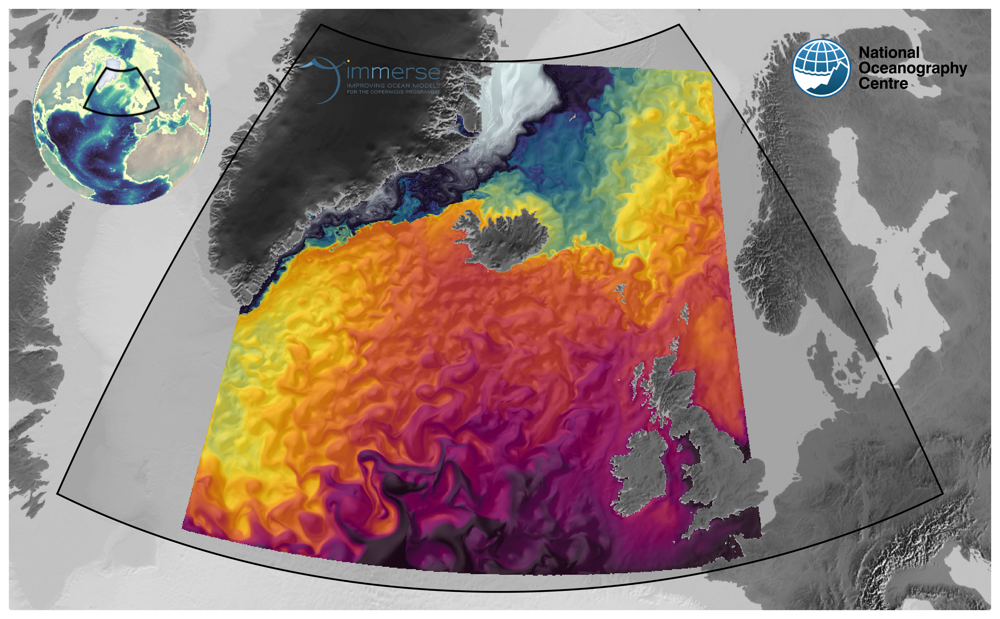

# wp6.2-demonstator

## Quick start on Archer2:
```shell
git clone git@github.com:immerse-project/wp6.2-demonstrator.git
cd wp6.2-demonstrator
./setup
```

Slurm examples:
```shell
./scripts/python/mkslurm_immerse -S 24 -s 16 -m 1 -C 9006 -g 0 -a n01-CLASS -j WP6.2 --gnu > scripts/run_nemo.slurm
./scripts/python/mkslurm_immerse -S 24 -s 16 -m 1 -C 3668 -g 0 -a n01-CLASS -q short --gnu > scripts/run_nemo-short.slurm
```

## Setup
### Parent: Global
Resolution:
- Horizontal: 1/12°
- Vertical: 75 levels

### Child 1: Greenland-Scotland Ridge
Resolution:
- Horizontal: 1/36°
- Vertical: 150 levels



### Child 2: Gibraltar Strait
Resolution:
- Horizontal: 1/36°
- Vertical: 150 levels
